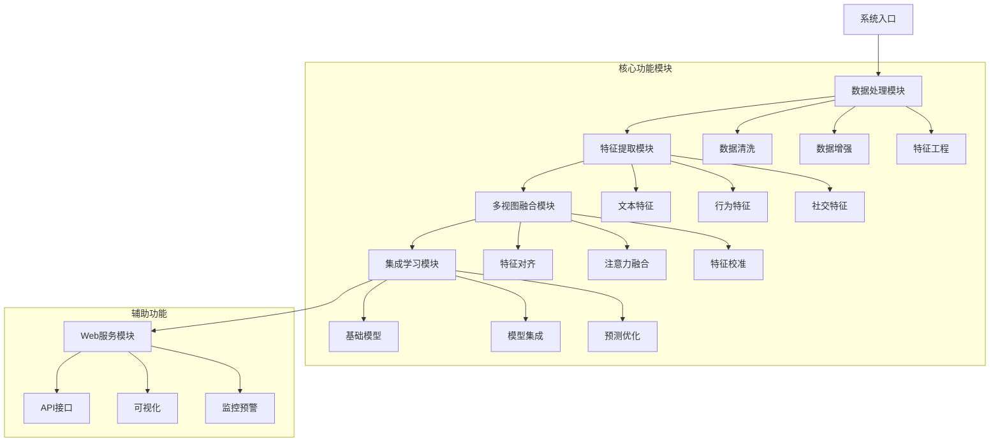
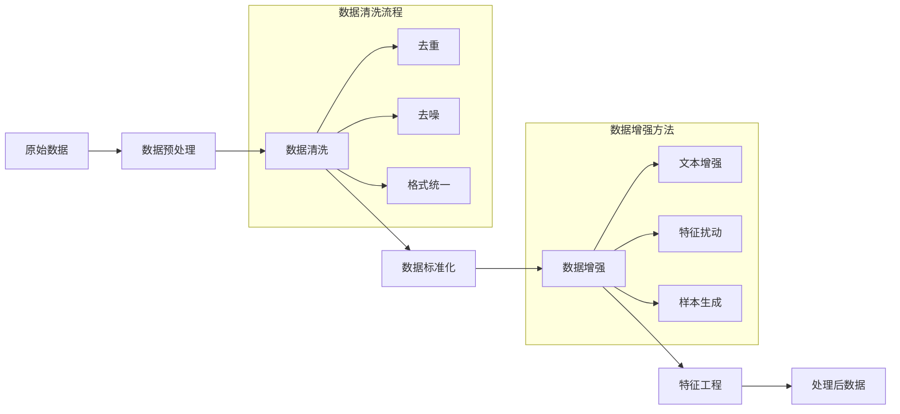
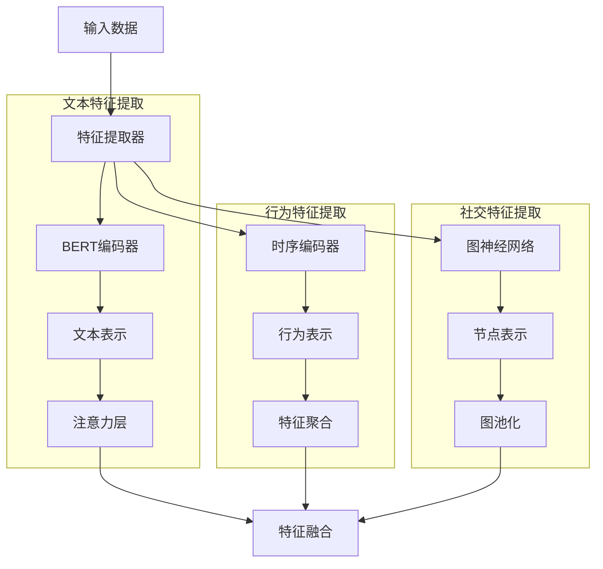
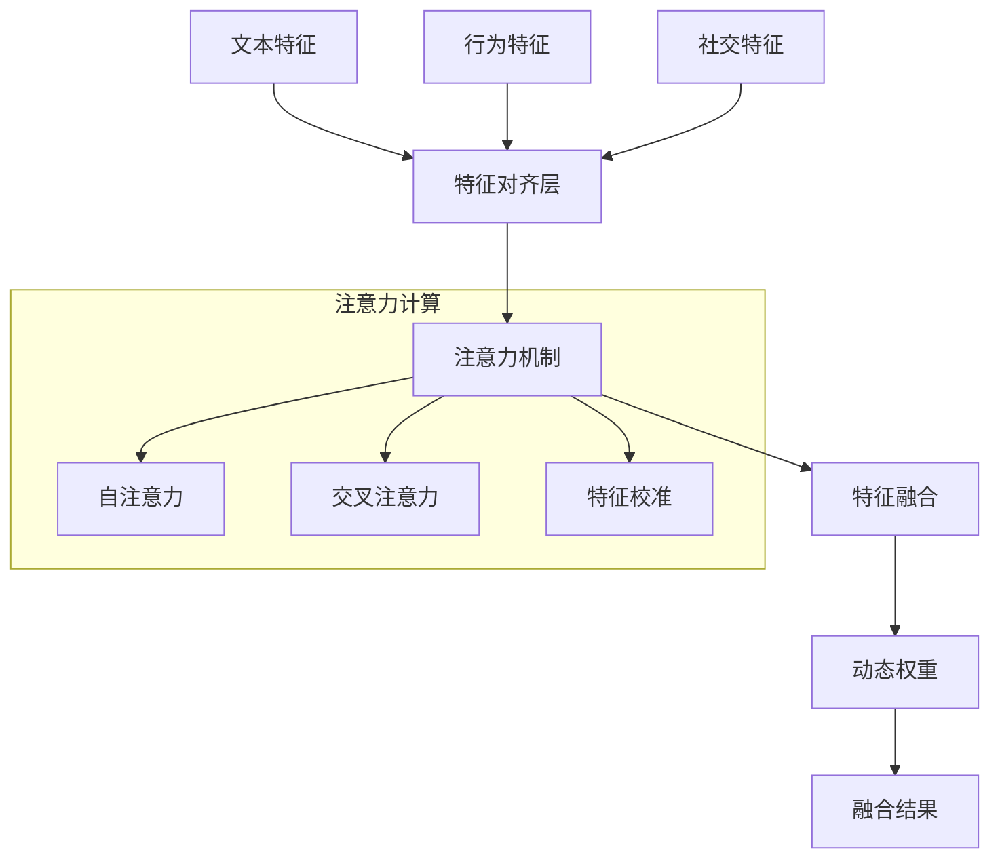
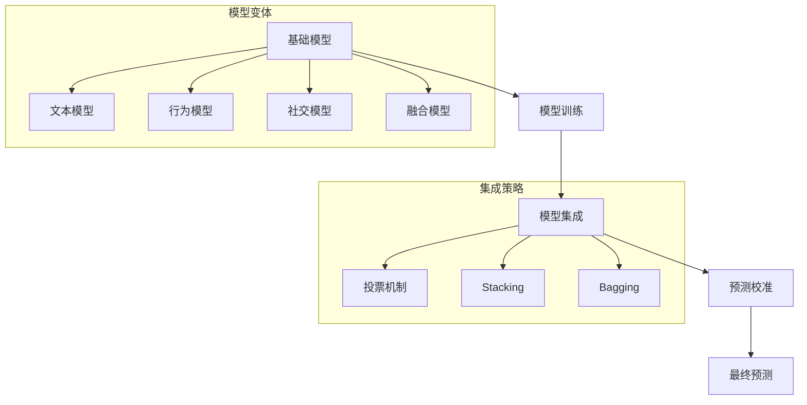
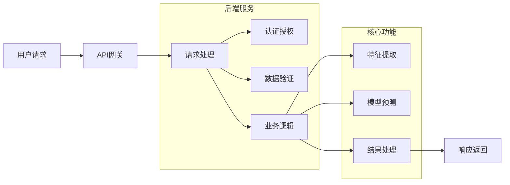
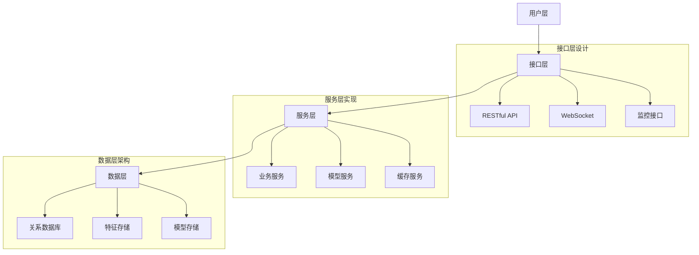
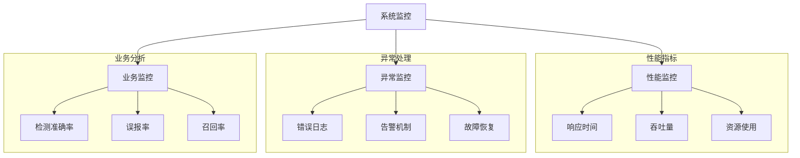

# 第三章 系统设计与实现流程图

本文档使用Mermaid语法绘制第三章相关的系统设计与实现流程图。

## 1. 系统总体架构

```mermaid
graph TB
    A[系统入口] --> B[数据处理模块]
    B --> C[特征提取模块]
    C --> D[多视图融合模块]
    D --> E[集成学习模块]
    E --> F[Web服务模块]
    
    subgraph 核心功能模块
    B --> B1[数据清洗]
    B --> B2[数据增强]
    B --> B3[特征工程]
    
    C --> C1[文本特征]
    C --> C2[行为特征]
    C --> C3[社交特征]
    
    D --> D1[特征对齐]
    D --> D2[注意力融合]
    D --> D3[特征校准]
    
    E --> E1[基础模型]
    E --> E2[模型集成]
    E --> E3[预测优化]
    end
    
    subgraph 辅助功能
    F --> F1[API接口]
    F --> F2[可视化]
    F --> F3[监控预警]
    end
```

## 2. 数据处理模块设计

```mermaid
graph LR
    A[原始数据] --> B[数据预处理]
    B --> C[数据清洗]
    C --> D[数据标准化]
    D --> E[数据增强]
    E --> F[特征工程]
    F --> G[处理后数据]
    
    subgraph 数据清洗流程
    C --> C1[去重]
    C --> C2[去噪]
    C --> C3[格式统一]
    end
    
    subgraph 数据增强方法
    E --> E1[文本增强]
    E --> E2[特征扰动]
    E --> E3[样本生成]
    end
```

## 3. 特征提取模块设计

```mermaid
graph TB
    A[输入数据] --> B[特征提取器]
    
    subgraph 文本特征提取
    B --> C1[BERT编码器]
    C1 --> C2[文本表示]
    C2 --> C3[注意力层]
    end
    
    subgraph 行为特征提取
    B --> D1[时序编码器]
    D1 --> D2[行为表示]
    D2 --> D3[特征聚合]
    end
    
    subgraph 社交特征提取
    B --> E1[图神经网络]
    E1 --> E2[节点表示]
    E2 --> E3[图池化]
    end
    
    C3 --> F[特征融合]
    D3 --> F
    E3 --> F
```

## 4. 多视图融合模块设计

```mermaid
graph TB
    A1[文本特征] --> B[特征对齐层]
    A2[行为特征] --> B
    A3[社交特征] --> B
    
    B --> C[注意力机制]
    
    subgraph 注意力计算
    C --> C1[自注意力]
    C --> C2[交叉注意力]
    C --> C3[特征校准]
    end
    
    C --> D[特征融合]
    D --> E[动态权重]
    E --> F[融合结果]
```

## 5. 集成学习模块设计

```mermaid
graph TB
    A[基础模型] --> B[模型训练]
    B --> C[模型集成]
    
    subgraph 模型变体
    A --> A1[文本模型]
    A --> A2[行为模型]
    A --> A3[社交模型]
    A --> A4[融合模型]
    end
    
    subgraph 集成策略
    C --> C1[投票机制]
    C --> C2[Stacking]
    C --> C3[Bagging]
    end
    
    C --> D[预测校准]
    D --> E[最终预测]
```

## 6. Web服务模块设计

```mermaid
graph LR
    A[用户请求] --> B[API网关]
    B --> C[请求处理]
    
    subgraph 后端服务
    C --> D1[认证授权]
    C --> D2[数据验证]
    C --> D3[业务逻辑]
    end
    
    subgraph 核心功能
    D3 --> E1[特征提取]
    D3 --> E2[模型预测]
    D3 --> E3[结果处理]
    end
    
    E3 --> F[响应返回]
```

## 7. 系统部署架构

```mermaid
graph TB
    A[用户层] --> B[接口层]
    B --> C[服务层]
    C --> D[数据层]
    
    subgraph 接口层设计
    B --> B1[RESTful API]
    B --> B2[WebSocket]
    B --> B3[监控接口]
    end
    
    subgraph 服务层实现
    C --> C1[业务服务]
    C --> C2[模型服务]
    C --> C3[缓存服务]
    end
    
    subgraph 数据层架构
    D --> D1[关系数据库]
    D --> D2[特征存储]
    D --> D3[模型存储]
    end
```

## 8. 系统监控设计

```mermaid
graph TB
    A[系统监控] --> B[性能监控]
    A --> C[异常监控]
    A --> D[业务监控]
    
    subgraph 性能指标
    B --> B1[响应时间]
    B --> B2[吞吐量]
    B --> B3[资源使用]
    end
    
    subgraph 异常处理
    C --> C1[错误日志]
    C --> C2[告警机制]
    C --> C3[故障恢复]
    end
    
    subgraph 业务分析
    D --> D1[检测准确率]
    D --> D2[误报率]
    D --> D3[召回率]
    end
``` 