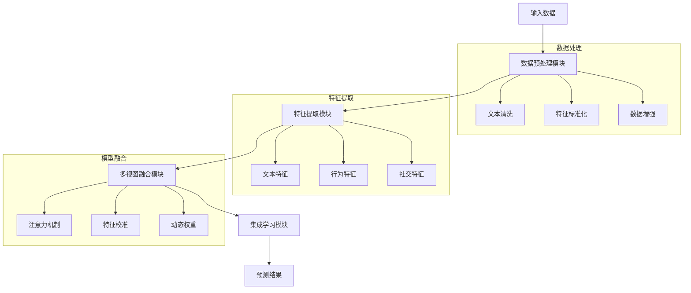
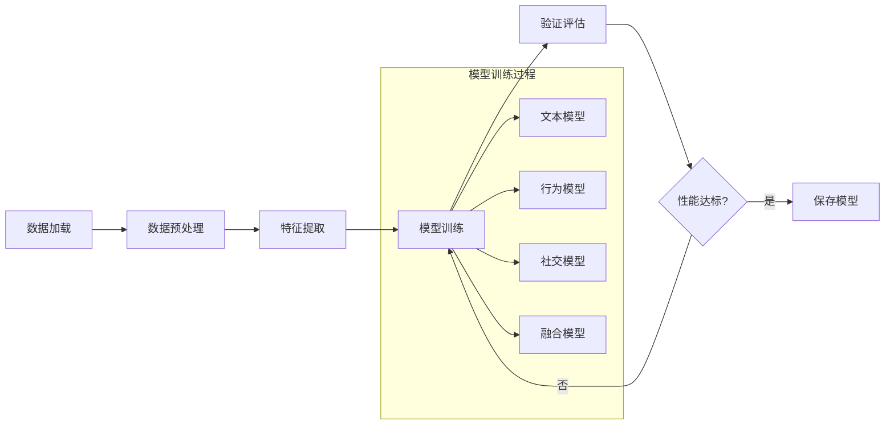
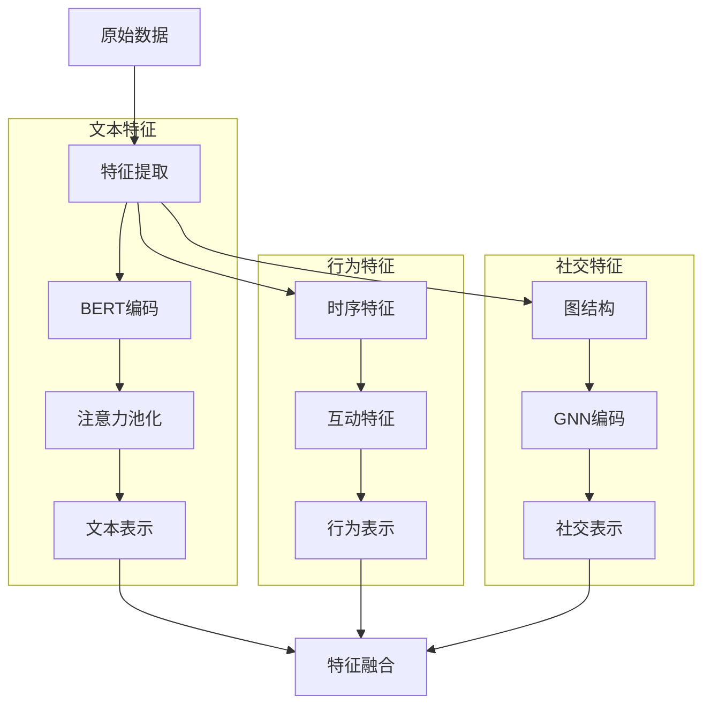
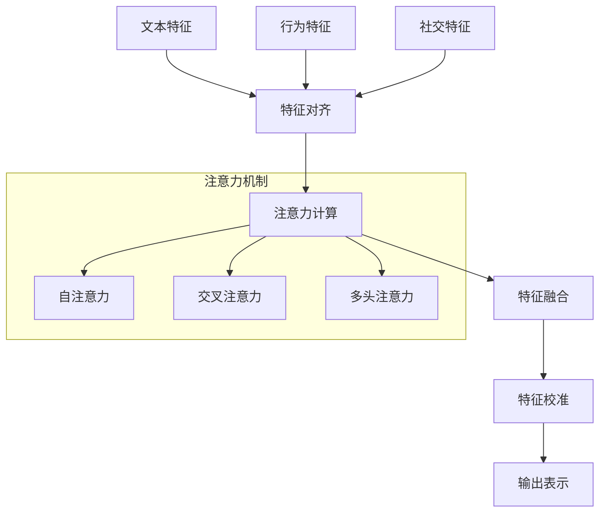
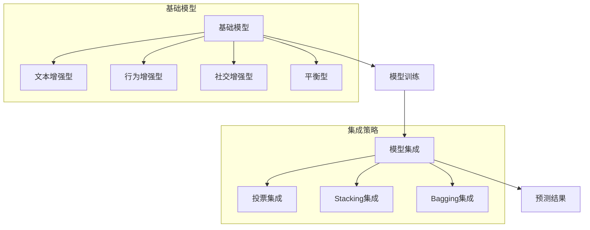
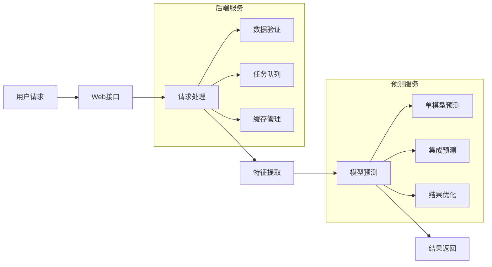
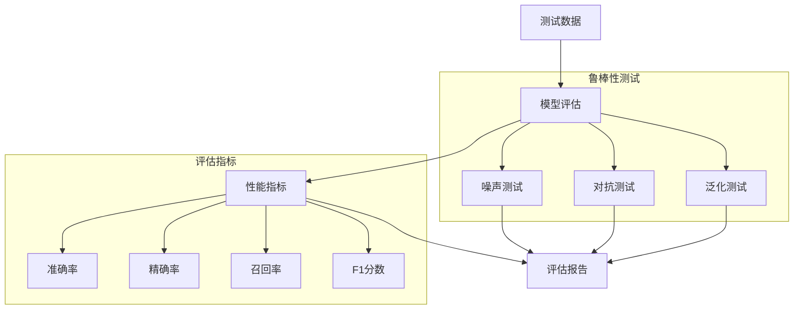
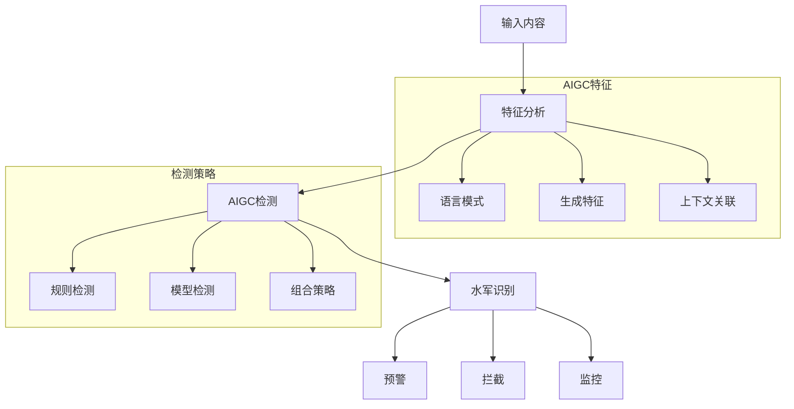

# 论文流程图

本文档使用Mermaid语法绘制系统的各个流程图。

## 1. 系统整体架构

```mermaid
graph TB
    A[输入数据] --> B[数据预处理模块]
    B --> C[特征提取模块]
    C --> D[多视图融合模块]
    D --> E[集成学习模块]
    E --> F[预测结果]
    
    subgraph 数据处理
    B --> B1[文本清洗]
    B --> B2[特征标准化]
    B --> B3[数据增强]
    end
    
    subgraph 特征提取
    C --> C1[文本特征]
    C --> C2[行为特征]
    C --> C3[社交特征]
    end
    
    subgraph 模型融合
    D --> D1[注意力机制]
    D --> D2[特征校准]
    D --> D3[动态权重]
    end
```

## 2. 训练流程

```mermaid
flowchart LR
    A[数据加载] --> B[数据预处理]
    B --> C[特征提取]
    C --> D[模型训练]
    D --> E[验证评估]
    E --> F{性能达标?}
    F -->|是| G[保存模型]
    F -->|否| D
    
    subgraph 模型训练过程
    D --> D1[文本模型]
    D --> D2[行为模型]
    D --> D3[社交模型]
    D --> D4[融合模型]
    end
```

## 3. 特征提取流程

```mermaid
graph TB
    A[原始数据] --> B[特征提取]
    
    subgraph 文本特征
    B --> C1[BERT编码]
    C1 --> C2[注意力池化]
    C2 --> C3[文本表示]
    end
    
    subgraph 行为特征
    B --> D1[时序特征]
    D1 --> D2[互动特征]
    D2 --> D3[行为表示]
    end
    
    subgraph 社交特征
    B --> E1[图结构]
    E1 --> E2[GNN编码]
    E2 --> E3[社交表示]
    end
    
    C3 --> F[特征融合]
    D3 --> F
    E3 --> F
```

## 4. 多视图融合机制

```mermaid
graph TB
    A1[文本特征] --> B[特征对齐]
    A2[行为特征] --> B
    A3[社交特征] --> B
    
    B --> C[注意力计算]
    C --> D[特征融合]
    D --> E[特征校准]
    E --> F[输出表示]
    
    subgraph 注意力机制
    C --> C1[自注意力]
    C --> C2[交叉注意力]
    C --> C3[多头注意力]
    end
```

## 5. 集成学习框架

```mermaid
graph TB
    A[基础模型] --> B[模型训练]
    B --> C[模型集成]
    
    subgraph 基础模型
    A --> A1[文本增强型]
    A --> A2[行为增强型]
    A --> A3[社交增强型]
    A --> A4[平衡型]
    end
    
    subgraph 集成策略
    C --> C1[投票集成]
    C --> C2[Stacking集成]
    C --> C3[Bagging集成]
    end
    
    C --> D[预测结果]
```

## 6. Web服务架构

```mermaid
graph LR
    A[用户请求] --> B[Web接口]
    B --> C[请求处理]
    C --> D[特征提取]
    D --> E[模型预测]
    E --> F[结果返回]
    
    subgraph 后端服务
    C --> C1[数据验证]
    C --> C2[任务队列]
    C --> C3[缓存管理]
    end
    
    subgraph 预测服务
    E --> E1[单模型预测]
    E --> E2[集成预测]
    E --> E3[结果优化]
    end
```

## 7. 评估流程

```mermaid
graph TB
    A[测试数据] --> B[模型评估]
    B --> C[性能指标]
    
    subgraph 评估指标
    C --> C1[准确率]
    C --> C2[精确率]
    C --> C3[召回率]
    C --> C4[F1分数]
    end
    
    subgraph 鲁棒性测试
    B --> D1[噪声测试]
    B --> D2[对抗测试]
    B --> D3[泛化测试]
    end
    
    C --> E[评估报告]
    D1 --> E
    D2 --> E
    D3 --> E
```

## 8. AIGC检测流程

```mermaid
graph TB
    A[输入内容] --> B[特征分析]
    B --> C[AIGC检测]
    C --> D[水军识别]
    
    subgraph AIGC特征
    B --> B1[语言模式]
    B --> B2[生成特征]
    B --> B3[上下文关联]
    end
    
    subgraph 检测策略
    C --> C1[规则检测]
    C --> C2[模型检测]
    C --> C3[组合策略]
    end
    
    D --> E[预警]
    D --> F[拦截]
    D --> G[监控]
``` 